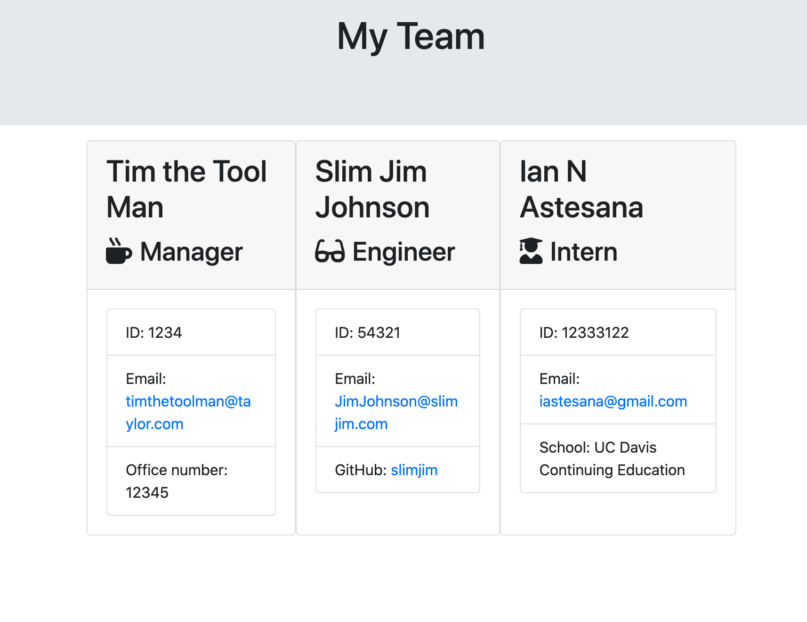

# Title: Command Line Team Builder

###### Desccription: I created a command line application. To generate HTML, that displays employee information.

## Developer: Ian N Astesana

### Profile: https://github.com/Greezon/employee-template-engine

#### Video examples of testing and how to run the app.
    https://drive.google.com/file/d/1hSmIBQR9yUnZMysxOPjWj5novxmkDo-F/view

    https://drive.google.com/file/d/1AwbFPJIUDMJa999HE6GO-woy5aBETFhS/view

1. License:
   MIT

1. Installation: 
   npm install

1. Usage: 
    Step 1. node app.js

1. Testing Methods: 
    Jest

1. Contributors: 
    Ian N Astesana

###### If you have any questions reach out to me by email. iastesana@gmail.com
    